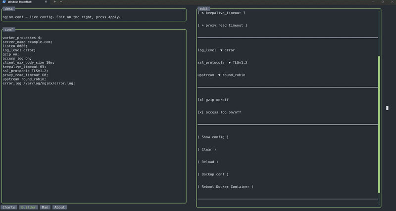
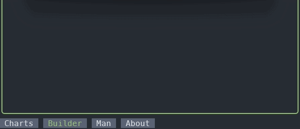
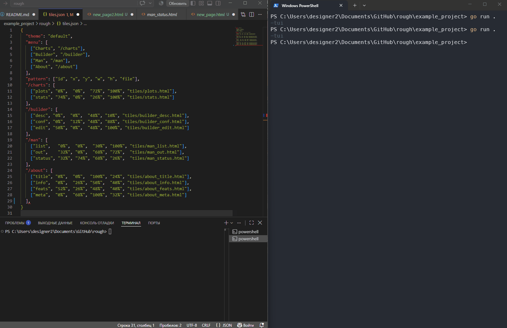
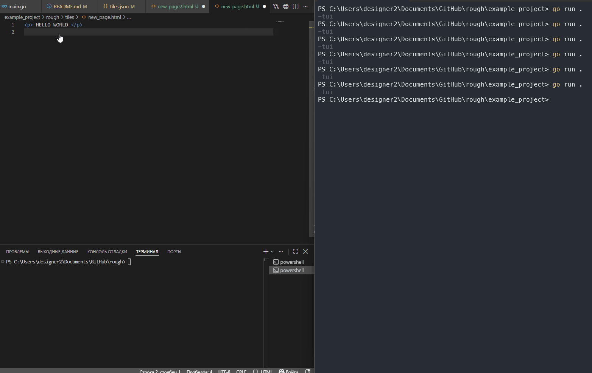

# rough

ROUGH outlines UI — go html

> **Status: v0.1** 

A simple tiled, resizable engine for quickly building a terminal UI with a mix of HTML markup and linux-like commands.

No web server, no browser. Use it as a library in your project, or as a standalone utility (with ssh and curl as plugins, among others) — and whatever else you come up with: hook it up to a COM port and drive a machine, or build a config editor so no clueless admin can click anything extra on the servers.



## What's going on

I'm tired of endless web servers in projects where they're not needed at all, and I'm equally tired of endless config files.
So: the same HTML, the same linux-like commands, and it all renders right in the terminal with buttons, fields and spinners. On top of that — the engine stretches tiles and their content to its own size by itself: resize the window and nothing breaks.



## Using it in a project



Three steps:

**1. Draw tiles** — divide the screen into rectangles with percentages or pixels in `tiles.json`:
```json
{
  "pattern": ["id", "x", "y", "w", "h", "file"],
  "/main": [
    ["cfg",  "0%",  "0%",  "40%", "100%", "tiles/cfg.html"],
    ["out",  "40%", "0%",  "60%", "100%", "tiles/out.html"]
  ]
}
```
Left — settings tile, right — output.

**2. Write HTML markup** inside each tile — headings, buttons, fields:



```html
<!-- tiles/cfg.html -->
<h1>Settings</h1>
<button action="cat:/etc/hostname">Hostname</button>
```

**3. Call plugins right from HTML** — like linux commands:
```html
<button action="cat:/etc/hostname">Hostname</button>
<button action="ssh:root:srv1::uptime">Uptime on srv1</button>
```

The "guts" of the buttons are written in Go — they're command plugins: **strings in, strings out**. The engine itself can't do anything — all the logic lives in plugins. Contract requirements are in the cookbook.

## What it looks like

Type a package name in a field — the help appears in a neighbouring tile:

```html
<!-- "input" tile -->
<input action="man:" output="out" label="Package"/>

<!-- "output" tile (id="out" (IMPORTANT)): the engine draws the command help here -->
```

`man` is an output command, like `cat`: whatever it runs, it shows. A button, an input field, a pipe — all of them are commands, and the result of any of them can be routed to your tile.

> Demo: `example_project/` — full demo (4 tabs: live charts, nginx builder, man, about). Run: `cd example_project && go run . -tui`.
> GIF source: `example_project/` — demo with 4 tabs (live charts, nginx config builder, man, about) to record `docs_ru/gifs/demo.gif`. Run: `cd example_project && go run . -tui`.

## Live example: write max_users into a config

Say your project lives in `/opt/my_docker_project/conf.conf` and you want to give an admin a "set max users" button. Easy:

```html
<!-- field: type 100 and press Enter → set writes max_users=100 -->
<input action="set:/opt/my_docker_project/conf.conf:max_users" label="max_users"/>

<!-- or a button with a fixed value right away -->
<button action="set:/opt/my_docker_project/conf.conf:max_users:100 | confirm">max_users = 100</button>
```

The `set` plugin reads a `key=value` file, sets the value and writes it back.
A clueless admin doesn't touch the config by hand and can't break anything — only what you gave them as a button. Plugin logic can be seen right in the plugins' code — there's a built-in `man` help there.

## How to use in your Go project

1. Add the module: `go get github.com/arctcl/rough@v0.1.0`
2. Put a `rough/` folder next to `main.go`: `tiles.json`, `tiles/*.html`, `themes/*.json` and `plugins/plugins.go` (link to the plugins).
3. Embed the folder and run:

```go
//go:embed rough
var roughDir embed.FS

func main() { rough.TUI(roughDir) }
```

Run with the UI — `myapp -tui` (without the flag the program works as usual).
Your own plugins — `rough.AddPlugin("name", func(...) ...)` in your `main.go`.
Everything is embedded into a single file — no `rough/` folder needed in production.

## What you can build

**Admin panel.** Settings checkboxes, tables, log output:

```html
<checkbox action="toggle:app.conf:logging">Logging</checkbox>
<button action="cat:/var/log/app/errors.log | grep:ERROR">Errors</button>
```

**SSH orchestrator.** A "deploy update" button — `ssh` with keys from a folder, `| confirm` asks before running:

```html
<button action="ssh:root:srv1::apt update && apt upgrade -y | confirm">Deploy update</button>
```

`ssh` runs a command on a host (keys from `/root/keys`), `| confirm` — a confirmation window before deploying.

**Any automation.** Timed charts, panic buttons:

```html
<plugin pipe="cat:/tmp/core_temp | cut::1 | bars" interval="1s"/>
```

## Idea

- engine = empty frame + cursor; all the logic — plugins
- button = plugin call: `<button action="cat:/etc/hostname">`
- everything natively in Go — ssh, curl, sqlite; works even in a scratch container
- plugin help — right in the UI (`man`)

More: [docs (EN)](docs_en/), [docs (RU)](docs_ru/) — cookbooks (plugins, themes, project), how-it-works, architecture.

## License

Engine and plugins — [MIT](LICENSE). Dependencies are permissive (Apache-2.0, MIT, BSD-3) — no copyleft, safe for closed-source projects.

---

<div align="center"><b>───── Русская версия · Russian version ─────</b></div>

---

# rough

ROUGH outlines UI — go html


Это простой тайловый резиновый движок для быстрого поднятия интерфейса в терминале с использованием микса html разметки и linux-like команд

Без веб-сервера, без браузера, как библиотека твоего проекта или stand-alone утилита(с ssh и curl как плагинами в том числе) и что ты еще придумаешь, по идее хоть в COM порт подключай и управляй станком или пили редактор конфигов, чтобы любой эникей не смог ничего лишнего натыкать в серверах


## Что вообще происходит

Мне надоели бесконечные веб сервера в проектах, в которых они вообще не нужны и так же мне надоели бесконечные файлы конфигураций
Итого: тот же html, те же linux-like команды и рисуется это все прямо в терминале с кнопочками, полями и крутилками. И плюс ко всему этому - движок сам по себе растягивает тайлы и наполнение под свой размер - растянул окно и ничего не поплыло


## Реализация в проекте


Три шага:

**1. Рисуешь тайлы** — делишь экран на прямоугольники процентами или пикселями в `tiles.json`:
```json
{
  "pattern": ["id", "x", "y", "w", "h", "file"],
  "/main": [
    ["cfg",  "0%",  "0%",  "40%", "100%", "tiles/cfg.html"],
    ["out",  "40%", "0%",  "60%", "100%", "tiles/out.html"]
  ]
}
```
Слева тайл настроек, справа — вывод.

**2. Пишешь HTML-разметку** внутри каждого тайла — заголовки, кнопки, поля:


```html
<!-- tiles/cfg.html -->
<h1>Настройки</h1>
<button action="cat:/etc/hostname">Hostname</button>
```

**3. Вызываешь плагины прямо из HTML** — как Linux-команды:
```html
<button action="cat:/etc/hostname">Hostname</button>
<button action="ssh:root:srv1::uptime">Uptime на srv1</button>
```

А «начинку» кнопок пишут на Go — это плагины-команды: **строки на входе, строки на выходе**. Движок сам ничего не умеет — вся логика в плагинах. требования к контрактам см в кукингбуке

## Как это выглядит

Ввёл имя пакета в поле — справка появилась в соседнем тайле:

```html
<!-- тайл «ввод» -->
<input action="man:" output="out" label="Пакет"/>

<!-- тайл «вывод» (id="out"(ЭТО ВАЖНО)): сюда движок рисует справку по команде -->
```

`man` — команда вывода, как `cat`: что выполнил, то и показал. Кнопка, поле ввода, пайп — всё это команды, и результат любой из них можно направить в свой тайл.

> Демо: `example_project/` — демо с 4 вкладками (живые графики, редактор nginx, справка, о проекте). Запуск: `cd example_project && go run . -tui`.
> Источник GIF: `example_project/` — демо с 4 вкладками (живые графики, редактор конфига nginx, справка, о проекте) для записи `docs_ru/gifs/demo.gif`. Запуск: `cd example_project && go run . -tui`.

## Живой пример: записать max_users в конфиг

Допустим, у тебя проект в `/opt/my_docker_project/conf.conf` и надо дать админу
кнопку «задать максимальное число пользователей». Просто:

```html
<!-- поле: ввёл 100 и нажал Enter → set записал max_users=100 -->
<input action="set:/opt/my_docker_project/conf.conf:max_users" label="max_users"/>

<!-- или сразу кнопка с фиксированным значением -->
<button action="set:/opt/my_docker_project/conf.conf:max_users:100 | confirm">max_users = 100</button>
```

Плагин `set` читает файл `ключ=значение`, ставит значение и пишет обратно.
Эникей не лезет в конфиг руками и не может ничего сломать — только то,
что ты дал кнопкой. Логику плагинов можно посмотреть в коде самих плагинов - там встроенная справка для man 

## Как подключить в свой проект на GO

1. Подключи модуль: `go get github.com/arctcl/rough@v0.1.0`
2. Положи папку `rough/` рядом с `main.go`: там `tiles.json`, `tiles/*.html`, `themes/*.json`
   и `plugins/plugins.go` (линк на плагины).
3. Вшивай папку и запускай:

```go
//go:embed rough
var roughDir embed.FS

func main() { rough.TUI(roughDir) }
```

Запуск с интерфейсом — `myapp -tui` (без флага программа работает как обычно).
Свои плагины — `rough.AddPlugin("имя", func(...) ...)` в своём `main.go`.
Всё вшивается в один файл — на проде папка `rough/` не нужна.


## Что можно построить

**Админка.** Чекбоксы настроек, таблицы, вывод логов:

```html
<checkbox action="toggle:app.conf:logging">Логи</checkbox>
<button action="cat:/var/log/app/errors.log | grep:ERROR">Ошибки</button>
```

**SSH-оркестратор.** Кнопка «раскатать апдейт» — `ssh` с ключами из папки,
`| confirm` спросит перед выполнением:

```html
<button action="ssh:root:srv1::apt update && apt upgrade -y | confirm">Раскатать апдейт</button>
```

`ssh` выполняет команду на хосте (ключи из `/root/keys`), `| confirm` — окно
подтверждения перед раскаткой.

**Любая автоматика.** Графики по таймеру, аварийные кнопки:

```html
<plugin pipe="cat:/tmp/core_temp | cut::1 | bars" interval="1s"/>
```

## Идея

- движок = пустая рамка + курсор; вся логика — плагины
- кнопка = вызов плагина: `<button action="cat:/etc/hostname">`
- всё нативно в Go — ssh, curl, sqlite; работает даже в scratch-контейнере
- справка по плагинам — прямо в интерфейсе (`man`)

Подробнее: [документация (RU)](docs_ru/), [документация (EN)](docs_en/) — кукингбуки (плагины, темы, проект), how-it-works, архитектура.

## Лицензия

Движок и плагины — [MIT](LICENSE). Зависимости пермиссивные (Apache-2.0, MIT, BSD-3) — копилефта нет, можно использовать в закрытых проектах.


