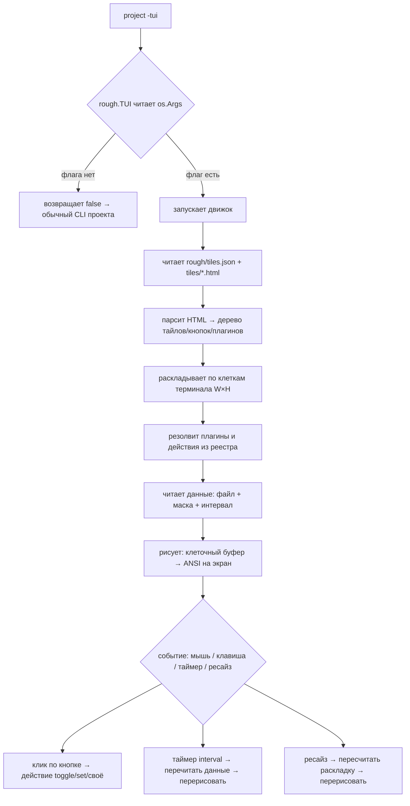

# Rough — Архитектура

> Движок TUI-интерфейсов для консоли: HTML-разметка рендерится нативно в клетки терминала.
> Никакого веб-сервера, никакого SSH-сервера, никакого JSON-конфига и CSS-движка.

---

## 1. Идея и цель

Надоело лезть в веб-интерфейсы и файлы конфигов. Хотим, чтобы простые админы быстро
и понятно настраивали что угодно прямо в терминале — без гуглежки и ИИ.

**Формула:**
```
project -tui   →   пиздатый интерфейс в терминале, без веб-сервера
```

- Проект запускается как обычный CLI, но с флагом `-tui` открывает полноценный интерфейс.
- Админ подключается по SSH к серверу (это его забота, не наша) и запускает `project -tui`
  в своём терминале — на 4K экране или 640×480, неважно.
- **Всё считается от ширины/высоты терминала в символах** (`W×H` клеток), поэтому
  интерфейс адаптивен к любому окну без знания заранее.

**Нативная идея:** переносим подход HTML/CSS-вёрстки в терминал. Не браузер — свой
мини-движок раскладки, который рендерит в клетки (символы) вместо пикселей.

---

## 2. Ключевой принцип разработки

> **Умный пишет плагин. Тупой пишет вызов в HTML.**

И второе, жёсткое правило:

> **Сам rough не умеет НИЧЕГО. Вся функциональность — только плагины.**

`cat`, `tail`, `grep`, `head`, `wc`, `toggle`, `set` — всё это плагины.
(`run` — запрещён движком: никакого произвольного запуска команд.)
Ядро `rough` — это **пустая оболочка**: парсит HTML, раскладывает по клеткам,
рисует, ловит мышь и держит реестр плагинов. Ни одной «встроенной» операции.

Отсюда:

- **90% случаев** — разработчик вообще не пишет код: только HTML с одним атрибутом `action`.
- **10% случаев** — умный разработчик пишет Go-плагин (новый инструмент/действие/источник
  данных/рисовалка), и после этого тупой просто пишет вызов в HTML.

Действия должны быть **юникс-лайк до упора**: `action="cat:...`, `action="tail:...`,
`action="grep:...` — коротко, единообразно, предсказуемо, как команды в консоли.

Никаких сложных структур, интерфейсов и конфигов для простых действий.

---

## 3. Модель интеграции

`rough` — это **Go-библиотека** (модуль, `package rough`). Проект подключает её через
`replace` в `go.mod` и вызывает одну функцию.

### Интеграция в проект — максимум 4 строчки кода

```go
package main

import (
	"embed"

	"rough"

	_ "myproject/rough/plugins" // вот мои плагины (Go-код, вшивается при сборке)
)

//go:embed rough
var roughDir embed.FS // вот папка с html/темами/данными (вшивается в бинарник)

func main() {
	rough.TUI(roughDir) // один вызов
}
```

```
myproject\
  go.mod                  # replace rough => ../rough
  main.go                 # 4 строчки выше
  rough\                  # ВСЁ про проект: данные + плагины (вшиваются через //go:embed)
    tiles.json            # страницы и тайлы (перечисление, без повторов)
    tiles\*.html          # вёрстка тайлов
    themes\*.json         # темы
    plugins\              # ТВОИ плагины (.go код модуля проекта)
      plugins.go          # агрегатор: перечисляет плагины
```

**Библиотека = только движок.** Внутри неё НЕТ плагинов и тем. При сборке движок +
твои плагины + папка `rough/` (через `//go:embed`) сливаются в **один исполняемый
файл**. На проде ничего снаружи не нужно. Плагины вшиты в бинарник — без пересборки
их не поменять (это безопасно). Движок при запуске читает всё из вшитой папки.

### main.go — вся интеграция это одна проверка

```go
func main() {
    if rough.TUI(roughDir) { // обработал -tui и вышел из интерфейса
        return
    }
    // ...твой обычный CLI как раньше...
}
```

`TUI()` смотрит `os.Args`: есть `-tui` → срезает префикс `rough/` из вшитой папки
и запускает движок (читает `tiles.json` + `tiles/*.html` + темы, рисует, блокирует
до выхода) и возвращает `true`. Нет → возвращает `false`, программа живёт как раньше.

### Жизненный цикл `project -tui`



---

## 4. Структура репозитория `rough`

```
c:\...\rough\                  # корень = модуль rough (package rough)
  go.mod                       # module rough
  rough.go                     # публичное API: TUI(embed.FS), AddPlugin()
  engine\                      # ДВИЖОК — чистый, НИ ОДНОГО плагина внутри
    backend.go                 # вёрстка: HTML → дерево → клетки + кликабельные зоны
    backend_conf_loader.go     # загрузчик конфига: tiles.json, координаты %/px (fs.FS)
    frontend.go                # холст: клеточный буфер → экран tcell (рамки, цвета)
    plugin_registry.go         # единый регистр (AddPlugin) + пайпы + Window() + LoadUI
    people_input.go            # главный цикл + мышь/клавиши/таймер + окна ввода/подтверждения
    theme.go                   # темы: символы и цвета (палитра терминала / hex)
    syntax_checker.go          # проверяльщик: action/plugin/ссылки должны существовать
  plugins\                     # ВСЕ плагины в одном месте (корень репозитория)
    plugins.go                 # агрегатор: все плагины ниже
    cat\  hello\              # базовые (примеры)
    ssh\  curl\                # сетевые (SSH и HTTP, нативно в Go)
    man\                       # справка: man_<имя> из каждого плагина
    grep\  tail\  head\  wc\   # текстовые фильтры (юникс-набор)
    line\  append\  toggle\  set\  # правка файлов и конфигов
    bars\  clock\              # графики и часы (адаптив через Window())
  example\                     # ЖИВОЙ ПРИМЕР (отдельный модуль): 4 строчки + rough/
    main.go                    # 4 строчки: import + embed + агрегатор + TUI()
    rough\                     # данные примера
      plugins\plugins.go       # «линк» на корневой пакет plugins
  docs\                        # вся документация (architecture/demo/systemprompt)
  README.md                    # для GitHub (актуальный)
```

Внешний мир видит: движок (`rough.go` + `engine/`) — чистый, без плагинов;
плагины (`rough/plugins`) — отдельный пакет в корне репозитория, на который проект
пользователя «ссылается» одним импортом. Движок ничего не умеет: убери плагины —
останется пустая рамка и курсор.

---

## 5. Формат интерфейса — tiles.json + HTML-файлы тайлов

Структура страниц — минимальный `tiles.json` (чистое перечисление параметров, без
повторяющихся ключей). Контент тайла — отдельный HTML-файл в `tiles/`.

### tiles.json — страницы и тайлы

```json
{
  "/main": [
    ["time", "0%",   "0%",  "10%",  "10%",  "tiles/time.html"],
    ["plan", "10%",  "0%",  "90%",  "100%", "tiles/plan.html"],
    ["out",  "0%",   "10%", "10%",  "90%",  "tiles/out.html"]
  ],
  "/info": [
    ["cpu",  "0%",   "0%",  "100%", "100%", "tiles/cpu.html"]
  ]
}
```

Позиционный массив тайла: `[id, x, y, w, h, файл]`. Каждая позиция — строка с `%`
(процент) или число (пиксели-клетки). Никаких повторяющихся ключей — именно то,
что нужно: «перечисление параметров».

### Контент тайла — HTML-файл

```html
<!-- rough/tiles/time.html -->
<b>12:34:56</b>
<button action="toggle:/etc/myapp/app.conf:logging">Логи</button>
```

Внутри тайла доступны теги:
- **Разметка**: `<b>`, `<i>`, `<h1>`, `<br>`, `<hr>`, `<center>`, `<row>`
- **Действие**: `<button action="...">` — клик выполняет пайп
- **Поле ввода**: `<input action="..." label="...">` — окно ввода, значение дописывается
- **Переход**: `<a href="/route">` — клик меняет роут
- **Плагин**: `<plugin pipe="...">` — живой пайп в тайле

Пример тайла с плагином (пайп):

```html
<!-- rough/tiles/cpu.html -->
<h1>CPU</h1>
<center>
  <plugin pipe="file:/tmp/log/cpu_load.log | bars:cpu=(\d+)" interval="1s"/>
</center>
```

Есть и короткая форма без пайпа: `<plugin name="tail" path="/var/log/x.log"/>` —
движок сам соберёт `file:... | tail`.

### Единицы измерения: проценты И пиксели

Координаты и размеры принимают оба формата:

| Единица | Пример | Что значит |
|---|---|---|
| `px` (число) | `"20"` / `10` | ровно 20 клеток (колонок/строк) — точная позиция |
| `%` | `"10%"` | 10% от контейнера (резиново) |
| `vw` / `vh` | `"50vw"` | процент от ширины/высоты терминала |

Единицы можно **смешивать**: `["cpu", "0%", "0%", "30", "100%", ...]` — тайл ровно
30 клеток шириной и на всю высоту. Терминал = корневой контейнер `W×H` клеток:
px считаются в клетках, % пересчитываются от контейнера → адаптивность под любой
экран и мгновенный ресайз.

---

## 6. Действия — синтаксис `action`

Один атрибут, короткий, двоеточием. **«Строчку тыкнуть»** — библиотека сама находит
строку по ключу/номеру и переписывает её.

```html
<!-- переключить строку в конфиге: если 0 → станет 1, если 1 → станет 0 -->
<button action="toggle:/etc/myapp/app.conf:logging">Логи</button>

<!-- выставить значение по ключу -->
<button action="set:/etc/myapp/app.conf:worker_processes=4">4 воркера</button>

<!-- опасное действие: свой плагин + подтверждение через пайп -->
<button action="my_reboot | confirm">Перезапустить</button>

<!-- «тыкнуть» конкретную строку по номеру — перезаписать её -->
<button action="line:/etc/myapp/app.conf:12">Поправить строку 12</button>

<!-- добавить строку в конец -->
<button action="append:/etc/myapp/app.conf:debug=false">Выкл. дебаг</button>

<!-- своё действие, зарегистрированное в Go -->
<button action="my_custom_thing">Особое</button>
```

> **`run` запрещён движком.** Произвольный запуск команд через кнопку невозможен —
> движок не регистрирует и не выполняет действие `run`.

### Правило резолва — единое, всё через реестр плагинов

У движка **нет** «встроенных» действий. Любой `action` — это плагин-действие,
зарегистрированный в реестре (в том числе дефолтные `toggle/set/line/append`
и юникс-лайк `cat/tail/grep/...`).

1. Разбираем `action` на `имя:аргументы` (`имя` — до первого `:`).
2. Ищем плагин-действие с таким именем в реестре.
3. Нашли → передаём ему аргументы. Не нашли → ошибка «нет такого действия».

Дефолтные плагины просто поставляются вместе с библиотекой — но для движка они
ровно такие же, как твой `my_custom_thing`. Добавил свой `rough.AddPlugin("my", fn)`
→ `action="my:..."` работает наравне с `cat`.

---

## 7. Плагины — единая модель

Сам rough не умеет ничего: **всё, что делает библиотека, — это плагины.** Каждый
инструмент, действие, источник данных и рисовалка — **один и тот же тип** —
юникс-команда: строки на входе, строки на выходе.

```go
// Единый контракт плагина.
type PluginFunc func(in []string, args []string) ([]string, error)
```

Реестр один: `rough.AddPlugin(name, fn)`. Никаких «категорий» — действие это,
источник или рисовалка, решает позиция в пайпе, а не тип:

```html
<button action="cat:/etc/x.conf | grep:error | head:20"/>  <!-- кнопка = пайп -->
<plugin pipe="file:/tmp/cpu.log | bars:cpu=(\d+)" interval="1s"/>  <!-- тайл = пайп -->
```

### Справка man — у каждого плагина

Каждый плагин несёт справку в переменной `man_<имя>` (юникс-like man): первая
строка — краткое описание, дальше использование, аргументы и примеры сложного
синтаксиса (пайпы, необязательные флаги вроде `-i`). В `init()` она регистрируется
через `rough.AddMan("имя", man_имя)` рядом с `AddPlugin`. Показывает справку
плагин `man`:

```html
<button action="man">Что вообще есть</button>
<button action="man:ssh">Справка по ssh</button>
<button action="man:curl | head:10">Первые строки справки</button>
```

### Пример плагина «график с котятами»

```go
// plugins/kittens.go — просто плагин, строки → строки.
func init() {
    rough.AddPlugin("kittens", func(in []string, args []string) ([]string, error) {
        return []string{"  /\\_/\\", " ( o.o )  мяв", "  > ^ <"}, nil
    })
}
```

В HTML: `<button action="kittens">Показать кота</button>` или `<plugin name="kittens"/>`.

### Пайпы и confirm

- Пайп: `шаг1 | шаг2 | шаг3` — выход одного шага идёт на вход следующего.
- `| confirm` — гейт подтверждения: движок показывает окно «Выполнить?»,
  Enter — да, Esc — нет. Опасные кнопки: `<button action="... | confirm">`.
- Поле ввода: движок дописывает введённое значение как последний аргумент
  действия (слот `имя:арг:` или просто добавляет `:значение`).

### Почему не stdlib `plugin` (бестпрактис)

Пакет `plugin` (`.so`) официально не рекомендуется (документация Go):
- поддерживается только на Linux/FreeBSD/macOS, хрупкий;
- приложение и плагин должны быть собраны одним тулчейном, одними флагами,
  одними версиями зависимостей — иначе крэши;
- статический бинарник разворачивать проще, чем заботиться о расположении `.so`;
- загрузка непроверенных `.so` — вектор атаки.

**Вывод:** плагины = **саморегистрирующиеся Go-пакеты** (вызов `AddPlugin` в `init()`),
собираемые в единый статический бинарник. «Сунул файл» = добавил пакет
и подключил его (blank-import в агрегаторе). Это кросс-платформенно, типизировано
и проверяется компилятором.

---

## 8. Юникс-лайк инструменты как плагины — бестпрактис дистрибутивов

Действия должны быть юникс-лайк **до упора**: `cat`, `tail`, `grep`, `head`, `wc`,
`sort`, `cut`, `sed`-подобное — всё, всё, всё. И каждое — отдельный плагин
в корне репозитория `plugins/` (пример — `example/rough/plugins/plugins.go` на него ссылается),
регистрируемый как
`action="cat:..."`, `action="tail:..."` и т.д.

**Проблема:** эти команды не гарантированы ни на одном дистрибутиве.
- Минимальные контейнеры (alpine) — busybox;
- distroless / scratch — вообще ничего;
- coreutils vs busybox — разное поведение флагов.

**Решение (бестпрактис): не дёргать внешние бинарники вообще. Реализовать нативно в Go**
внутри каждого плагина. Стандартная библиотека Go покрывает всё:

| Инструмент | Реализация в Go (внутри плагина) |
|---|---|
| `cat` | `os.ReadFile` / `bufio.Scanner` |
| `grep` | `regexp` по строкам (маска-регексп) |
| `tail` (последние N строк) | чтение с конца файла |
| `tail -f` (следить) | перечитывание хвоста по таймеру (живой, без внешних зависимостей) |
| `head` | чтение первых N строк |
| `wc` | подсчёт строк/слов/байт |
| `ssh` | выполнение команды по SSH (`golang.org/x/crypto/ssh`), агент + ключи `~/.ssh` или `-i:ПУТЬ` |
| `curl` | GET по URL через `net/http` (никакого внешнего curl), тело построчно |
| `man` | справка: `man` — список плагинов, `man:имя` — описание (из `man_<имя>` плагинов) |
| `sort` / `cut` / `uniq` | ⏳ пока не реализованы — в планах |

**Преимущества:**
- бинарник работает на **любом** Linux и в **любом** контейнере, включая `scratch`;
- статическая сборка: `CGO_ENABLED=0` → один файл, никаких runtime-зависимостей;
- нет shell-эскейпинга и инъекций.

**`run` запрещён движком.** Плагин-действие `run` в библиотеку не входит, а движок
отказывается регистрировать и выполнять такое действие. Произвольный запуск команд
через кнопку невозможен. Если команда реально нужна — только через свой Go-плагин,
который разработчик пишет сам (это его код, а не «просто так»).

**Вывод:** сам `rough` умеет ровно ноль инструментов. Хочешь `cat` — подключил
плагин `unix` (или написал свой) → `action="cat:..."` работает. Не подключил —
движок честно скажет «нет такого действия».

---

## 9. Внутреннее устройство движка

### Клеточный буфер

Рендер работает в 2D-буфере клеток, потом собирается в ANSI-строку:

```go
type Style struct {
    Fg, Bg tcell.Color
    Bold, Italic, Underline bool
}

type Cell struct {
    Rune  rune
    Style Style
}

type Buffer struct {
    W, H int
    cells [][]Cell
}
```

Бэкенд ввода/экрана: `tcell` (даёт мышь, ресайз, alt-screen, truecolor).
Layout и рендер — свои.

### Раскладка

- `<tile>` — абсолютное позиционирование по `x/y/w/h`.
- Внутри тайла — вертикальный поток блоков, `<center>` — центрирование, `<row>` — ряд.
- Границы/рамки — бокс-символы `│ ─ ┌ ┐ └ ┘`, фон/текст — truecolor.

### Поток данных

```
<plugin pipe="file:/tmp/cpu.log | bars:cpu=(\d+)" interval="1s">
   → file читает файл → строки
   → bars (последний шаг) парсит числа по маске → рисует график
   → строки вывода рисуются в тайл
```

- **Пайп** — выход одного шага идёт на вход следующего (`RunSteps`).
- **Живой `tail -f`** — движок перерисовывает тайлы по таймеру (~500 мс),
  поэтому `pipe="tail:/var/log/x.log"` в тайле ведёт себя как `tail -f`
  (перечитывание хвоста, без внешних бинарников).
- Обновление — по таймеру; клик по кнопке — hit-test координаты мыши по
  дереву элементов → действие (пайп).

### Динамические размеры и адаптация рисовалок

У тайлов **динамические размеры** — они считаются от ширины/высоты терминала
и меняются при ресайзе. Поэтому рисовалка обязана уметь рисовать под свой размер.

**Требования к обработке:**

1. Движок перед запуском пайпа в `<plugin>` устанавливает **размер окна тайла
   `W×H` в клетках**, а плагин читает его через `engine.Window()`:
   ```go
   // Единый контракт не меняется: строки → строки.
   // Размер окна — отдельно, через Window().
   w, h := engine.Window()
   ```
2. Рисовалка **сама решает, как выводить**, исходя из `W×H`, и обязана
   **умещаться в окно** (растягиваться под размер).
3. Лишнее движок обрезает (клип), но рисовалка **не должна** на это полагаться.
4. **Названия и подписи** — не дело рисовалки: их кладёт разработчик в HTML
   (`<h1>`, `<p>`), а рисовалка рисует только контент.
5. Движок подставляет подпись **только если хватает высоты** — рисовалка
   решает пороги сама.

**Пример адаптации `bars` (внутри плагина):**
- окно `2×10` — только график `▁▂▃▄▅▆▇█` (столбиков ровно `w` штук);
- окно `5×10` и выше — график + строка-подпись `max=... min=...`;
- название «CPU» — в HTML тайла, а не в плагине.

**Итог:** плагины «дышат» вместе с тайлом: узкий тайл — сжатый вывод, широкий —
развёрнутый с подписями. Один и тот же `<plugin>` работает в любом размере.

---

## 10. Редактирование файлов: Linux-ориентированно, Docker-дружелюбно

Изначально **только Linux**. Редактирование конфигов — плагины `toggle/set/line/append`
(пишешь в `plugins/` своего проекта), работа с текстом:

- поиск строки по ключу/номеру и замена значения;
- **атомарная запись**: пишем во временный файл рядом → `rename` (не порвём файл,
  даже если контейнер убьют в момент записи);
- работа с **монтируемыми томами** (`-v /host/etc:/etc/...`), права сохраняются;
- в контейнере: `FROM alpine` + статический бинарник, `/etc` наружу томом —
  кнопка меняет конфиг на хосте.

---

## 11. Безопасность — нативная система (никакого своего замка)

**Ключевая идея:** не строим собственную авторизацию — используем **нативную
безопасность Linux**. Права решает ОС, а не движок.

### Модель: процесс от юзера → плагины наследуют его права

```
ограниченный админ → SSH → запускает project -tui (от юзера ops)
   → каждый плагин умеет ровно то, что умеет юзер ops в системе
```

Что бы ни нажимал админ за интерфейсом — файлы меняются и команды выполняются
**от имени процесса**, не больше. Права определяет ОС (юзеры/группы/`/etc/passwd`),
движок ничего не выдумывает. Плагин работает/не работает — потому что система
разрешила/не разрешила.

### Три слоя защиты

| Слой | Что даёт | Стоимость |
|---|---|---|
| **1. Whitelist по построению** | В HTML есть только те кнопки, что написал разработчик. Нет кнопки — нет действия | бесплатно |
| **2. Права процесса** | Юзер ops не root → запись в `/etc` и reboot падают с отказом ОС | бесплатно |
| **3. Ошибки ОС** | запрещённое просто падает с ошибкой в статусе — свой замок не строим | бесплатно |

### Жёсткие правила

- **`run` запрещён движком** — имя зарезервировано, регистрация и выполнение блокируются.
- **`cmd`-провайдера нет** — движок вообще не выполняет команды из HTML, ни кнопкой,
  ни источником данных.
- **Системная инфа** (uptime/load/mem/df) — нативные плагины, читающие `/proc`, ноль команд.
- **Нужно реально выполнить команду** (reboot, рестарт сервиса) — только свой Go-плагин,
  который разработчик пишет сам. Это его скомпилированный код, а не «просто так из HTML».

### Пример: reboot-плагин под свой дистрибутив

```go
// myproject/rough/plugins/reboot.go
package reboot

import (
	"errors"
	"os"
	"os/exec"
	"strings"

	"rough"
)

func init() {
	rough.AddPlugin("reboot", func(in []string, args []string) ([]string, error) {
		if isContainer() { // не ребутим хост из контейнера
			return nil, errors.New("reboot: это контейнер, хост не трогаем")
		}
		cmd := rebootCmd() // команда по init-системе
		out, err := exec.Command(cmd[0], cmd[1:]...).CombinedOutput()
		if err != nil {
			return nil, err
		}
		return []string{string(out)}, nil
	})
}

// rebootCmd — по дистрибутиву: systemd / openrc / sysvinit.
func rebootCmd() []string {
	if _, err := os.Stat("/run/systemd/system"); err == nil {
		return []string{"systemctl", "reboot"}
	}
	if _, err := os.Stat("/sbin/openrc-run"); err == nil {
		return []string{"openrc-shutdown", "-r", "now"}
	}
	return []string{"shutdown", "-r", "now"}
}

func isContainer() bool {
	b, err := os.ReadFile("/proc/1/cgroup")
	if err != nil {
		return false
	}
	return strings.Contains(string(b), "docker") ||
		strings.Contains(string(b), "containerd") ||
		strings.Contains(string(b), "lxc")
}
```

В HTML — просто кнопка: `<button action="reboot">Перезагрузить сервер</button>`.
Работает, если у процесса хватает прав (root). Нет прав — ОС откажет, и это правильно.

### Вывод

Своя авторизация — не нужна. Система и так всё умеет: юзеры, группы, права,
`sudo`, polkit. Наша задача — **не обходить её** и не давать кнопкам больше прав,
чем у процесса. Опасные кнопки помечаем шагом `| confirm` — движок спросит
«Выполнить?» перед запуском.

---

## 12. Текущее состояние и что осталось

### Сделано ✅

- **Библиотека = чистый движок**: внутри НЕТ плагинов и тем. Всё остальное — в проекте
  пользователя, и при сборке вшивается в один бинарник.
- **Интеграция = 4 строчки**: `import "rough"` + `_ "плагины"` + `//go:embed rough` +
  `rough.TUI(roughDir)`. Движок читает данные из вшитой папки (`embed.FS`).
- Движок: HTML → клетки → экран tcell, мышь/клавиши/таймер/ресайз,
  окна ввода и подтверждения.
- `tiles.json` (паттерн→данные, %/px), темы (`themes/`), проверяльщик синтаксиса.
- **Единый `AddPlugin` + пайпы**: один контракт `func(in, args) (out, err)`, шаги через `|`,
  `| confirm` — окно подтверждения, `engine.Window()` — размер окна для рисовалок.
- **Вывод в тайл**: `output="id"` на input/button → результат команды рисуется в блок
  `<div id="...">`; колонки `<row>` + `<div width="50%">` (плагины видят реальный размер
  через `Window()` — поменял процент, вёрстка сжалась сама).
- **Вкладки меню**: ключ `"menu"` в `tiles.json` — навбар внизу, переключение клик/Tab/цифры.
- Безопасность: `run` запрещён движком — из HTML нельзя выполнять произвольные команды;
  плагины вшиты в бинарник, на проде их не подменить без пересборки.
- Живой пример: `example/` (отдельный модуль, `go run . -tui`).

### Как проверить глазами

```
cd example
go run . -tui
```
Увидишь тайлы, кнопки (`hello`, `cat`), переход по страницам. Всё вшито в бинарник.

### Осталось (roadmap) ⏳

1. ~~Вёрстка: `checkbox`, `select`, `<table>`, `img`, скролл~~ — сделано:
   `checkbox`/`select` (с состоянием и меню), `<table>` (выравнивание колонок),
   `img` (PPM половинчатыми блоками `▀▄█`), `hr`, `pre`, скролл внутри тайла (колесо).
2. Плагины: `sql` (sqlite) — остальное
   (`grep`/`tail`/`head`/`wc`/`line`/`append`/`toggle`/`set`/`bars`/`clock`/`loop`/`man`/`ssh`/`curl`) — есть.
3. ~~Актуальный `README.md`~~ — сделан (см. корневой `README.md`).
4. ~~Проверка `CGO_ENABLED=0`~~ — сделан: статическая сборка работает (CGO=0).
5. ~~Тесты движка~~ — сделаны (`engine/backend_test.go`).

### Правила для следующей итерации

- Сначала прочитай `demo.md` (шаблон интеграции) и этот документ целиком.
- **Модель: библиотека = только движок; плагины и данные — в проекте, всё вшивается в бинарник.**
- Код и доки должны совпадать: единый `AddPlugin`, пайпы, без `run`.
- Минимум сущностей. Если можно не добавить тип/функцию — не добавляй.
- Комментарии и доки — строго на русском.
- `README.md` — актуальный, описывает примеры (админка/ssh-оркестратор/реактор).
